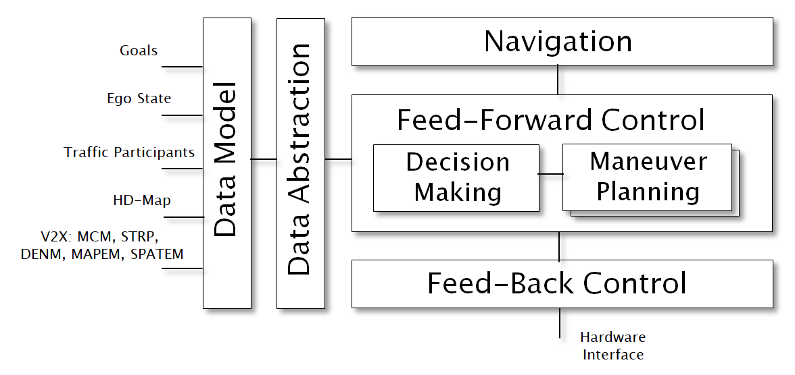

<!--
********************************************************************************
* Copyright (C) 2017-2020 German Aerospace Center (DLR). 
* Eclipse ADORe, Automated Driving Open Research https://eclipse.org/adore
*
* This program and the accompanying materials are made available under the 
* terms of the Eclipse Public License 2.0 which is available at
* http://www.eclipse.org/legal/epl-2.0.
*
* SPDX-License-Identifier: EPL-2.0 
*
* Contributors: 
********************************************************************************
-->

# libadore
libadore is the core implementation the ADORe framework

## Background 
libadore is a collection of libraries for education and research on Cooperative
Automated Vehicles (CAV). Its goal is to support different automation levels and
different driving capabilities with a set of well defined interfaces, data
models and controller implementations. We strive to minimize controller 
complexity and the amount of required data by making use of abstractions. The 
library is developed system independently in c++. In order to test and simulate 
concrete instances of automation designs, a generic interface to middleware 
software and data transmission is provided. 


*FIG: libadore/ADORe Architecture*

## Components
This section will offer a description and background on all available Components
within libadore.

* [**libadore/adore/fun**](libadore/adore/fun) - motion planning, decision making and control for AV
* [**libadore/adore/env**](libadore/adore/env) - environment description, data representation for AV
* [**libadore/adore/view**](libadore/adore/view) - data abstraction interface for AV, decouples fun and env
* [**libadore/adore/mad**](libadore/adore/mad) - math, algorithms and abstract data structures supporting AV
* [**libadore/adore/apps**](libadore/adore/apps) - middleware independent implementation of adore applications
* [**libadore/adore/params**](libadore/adore/params) - abstract parameter descriptions for AV
* [**libadore/adore/sim**](libadore/adore/sim) - simulation tools
* [**libadore/adore/if_xodr**](libadore/adore/if_xodr) - conversion of OpenDrive tracks into internal representation
* [**libadore/adore/if_r2s**](libadore/adore/if_r2s) - conversion of Road2Simulation tracks into internal representation

### Component Descriptions
libadore bundles several packages: Four central packages of the library are ENV
for environment models, FUN for planner and controller implementations, VIEW for
abstraction and decoupling of environment models and APPS for definition of 
applications based on a combination of ENV, FUN and VIEW. The package SIM 
defines models for the simulation of one or more automated vehicles. The package
PARAMS lists sets of parameters required for vehicle automation. The package MAD
defines a useful toolset for mathematical operations, algorithms and data 
structures. The package if_xodr converts [OpenDrive](http://www.opendrive.org/) 
road models to an internal road-map model.

One important design principle we strive to uphold is to avoid direct 
dependencies between models and controllers/planners. The VIEW package therefore
defines several task specific data abstraction interfaces. A set of models from 
ENV is used to provide data to a view, while a controller uses the high-level 
data provided by the view, without knowing the underlying models. This allows us
to easily exchange, re-organize and extend environment models. Furthermore, 
several alternative controller implementations for a specific task can be 
compared without implementing a task specific data refinement multiple times.

Another important principle is to avoid depending on specific communication or 
middleware frameworks. The APPS package defines several "proto" processes, which
interconnect model data acquisition, abstraction/refinement and planning and 
control modules, without referencing concrete middleware services. Communication
services are decoupled using an 
[abstract factory pattern](https://en.wikipedia.org/wiki/Factory_method_pattern).
Several packages (ENV, FUN, SIM) define abstract factories to standardize their 
data exchange. A separate project [adore_if_ros](https://github.com/DLR-TS/adore_if_ros)
implements middleware-dependent concrete factory and concrete product 
implementations.

Currently, libadore **does not** contain packages for sensor data fusion or 
interfacing with physical sensors. Assuming a typical "sense-plan-act" 
architecture, all vehicle automation modules downstream of "sense" are in the 
scope of this project.


## Build Status
[](https://github.com/DLR-TS/libadore/actions/workflows/ci.yaml)

## Getting Started
This module requires **make** and **docker** installed and configured for your user.

## Building
To build libadore run the following:
```bash
make build
```

## Testing
To run unit tests run the following target:
```bash 
make test
```

## Static checking
There are several included static analysis tools. To run them use the following:
```bash
make lint
```

```bash
make cppcheck
```

## External Libraries
libadore depends on several external libraries that do not provide
distributions.  They are packaged and hosted for adore via docker.io.
All external libraries are located in `libadore/external`. There is a provided
make file to build and publish all external libraries. By default all external
libraries are disabled in the `.gitmodules` file. They have been previously 
published to docker.io. In order to build them you must first enable the one 
you would like to build in the `.gitmodules` file. 

> **ℹ️ INFO:**
> External library submodues are disabled and will not be pulled. Enable them
> by modifying the `.gitmodules` and invoking 'git submodue update --init'.

> **ℹ️ INFO:**
> By default external libraries are not built. They are sourced first from local
> cache in /var/tmp/docker and seconds as pre-compiled docker images from docker.io.

The external libraries cache is not deleted or cleaned automatically. In order
to clean the external libriary cache located in `/var/tmp/docker` invoke the 
provided target:
```bash
make clean_external_cache
```

## License
The source code and the accompanying material is licensed under the terms of the [EPL v2](https://www.eclipse.org/legal/epl-2.0/).

## Contributors
- Daniel Heß
- Stephan Lapoehn
- Thomas Lobig
- Matthias Nichting
- Robert Markowski
- Jan Lauermann
- Reza Deriani
- Jonas Rieck
- Andrew Koerner

